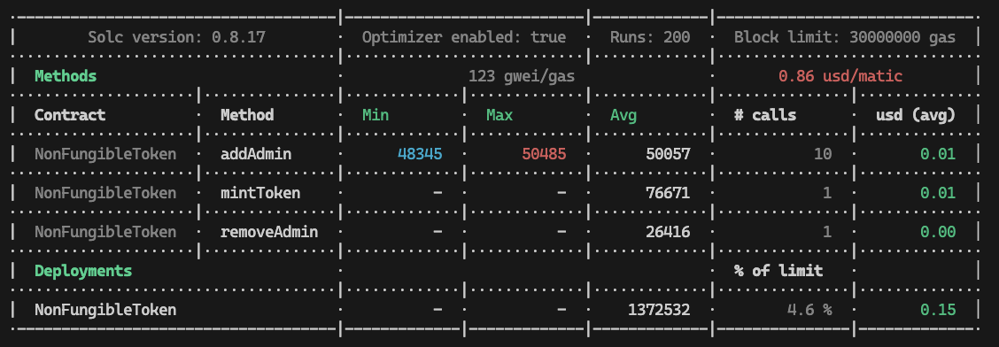

# ERC-721


## Cost & Optimizations


## Prerequisites

- This project utilizes coinmarketcap api to fetch and calculate actual gas costs for transactions.
- This project use polygon scan api to verify contract sourcecode after publishing to network
- This project uses alchemy as an RPC provider and ledger gateway

- Create an account on https://coinmarketcap.com/api/ . Get an api Key
- Create an account on https://polygonscan.com/register . Get an api key
- Create an account on https://www.alchemy.com/ . Create a new application and fetch an api key

## Configuration
- Create a .env file in your project
- Contents of the .env file should be as below
```
PUBLIC_KEY=<Public Address from metamask>
PRIVATE_KEY=<Private key from metamask>
POLYGON_SCAN_KEY=<Polygon scan API key>
ALCHEMY_KEY=<Alchemy API key>
COINMARKETCAP_KEY=<Coinmarket cap API key>
```

## Instructions
---
### To Compile Contracts
```
npm run compile
```

### To run tests
```
npm run test
```

### To deploy contract to local sandbox
```
npm run deploy-to-hardhat
```

### To deploy contract to Polygon testnet
```
npm run deploy-to-test
```

### To verify contract on polygon test net
```
npm run verify-on-test <contract address>
```